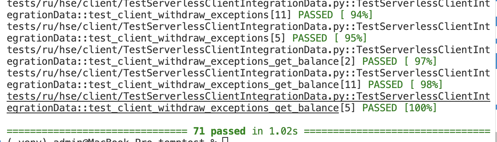

# ДЗ 4, Фролов Иван

(в создании файла помогал ИИ ассистент)

### Какие сделали компаненты

#### 1. **Заглушки (Mock объекты)**
- **MockAuthorizationSource.py** - имитирует поведение сервера авторизации
  - Методы: `register()`, `login()`, `logout()`
  - Управление активными сессиями и учетными записями
  
- **MockAccountDataSource.py** - имитирует работу с банковскими счетами
  - Методы: `deposit()`, `withdraw()`, `get_balance()`
  - Управление балансами и сессиями
  - Возвращает корректные `OperationResponse` коды согласно спецификации

#### 2. **Конфигурация тестов**
Заполнены все `#record` секции в тестовых классах с соответствующими mock возвращаемыми значениями:
- **TestServerlessAccountManagerAuth.py** (14 тестов) - тесты менеджера аккаунтов для авторизации
- **TestServerlessAccountModuleData.py** (15 тестов) - тесты модуля данных счета
- **TestServerlessClientIntegrationAuth.py** (12 тестов) - интеграционные тесты авторизации
- **TestServerlessClientIntegrationData.py** (28 тестов) - интеграционные тесты операций со счетом

#### 3. **Исправления в коде**

**AccountManager.py:**
- Доработана логика `call_register()` и `call_login()` для корректной обработки ответов от сервера
- Добавлена поддержка различных форматов тела ответа (int, serialized data)
- Исправлена проверка `call_logout()` чтобы правильно обрабатывать session ID = 0 (который является falsy в Python)

#### 4. **Результаты тестирования**

`pytest -v`

