

# Фролов Иван Григорьевич, HW5

## 1. Статический анализ (SpotBugs + PMD)

Добавлены:
- стандартная конфигурация PMD и SpotBugs,
- задача `staticAnalyze`,
- генерация html/xml отчетов,
- задача `runProfilingLoadTest` для нагрузочного профилирования.

### Первичный прогон
Выполнен запуск:
- `./gradlew clean staticAnalyze`

Отчеты сохранены в:
- `before_reports/pmd/main.html`
- `before_reports/spotbugs/main.html`

### Исправления по замечаниям анализаторов
Исправлено в коде:

1) Утечка in-memory сессий при логауте:
- `src/main/ru/hse/server/AccountServer.java`
- при `logout` теперь удаляются записи из `activeSessions` и `sessionEnabled`, также обнуляется `account.activeSession`.

2) Ошибка проверки сессии и утечки `ResultSet`:
- `src/main/ru/hse/server/ServerStorage.java`
- `testSession` исправлен с `executeUpdate()` на `executeQuery()`.
- все `ResultSet` переведены на try-with-resources.
- добавлен `close()` для корректного завершения пула `HikariDataSource`.

3) Корректная остановка сервера:
- `src/main/ru/hse/server/Server.java`
- `stop()` теперь закрывает API сервер и хранилище БД (`storage.close()`).

4) Исправление затенения поля:
- `src/main/ru/hse/server/ApiServer.java`
- поле сервера переименовано в `accountServer`, обращения в обработчиках обновлены.

### Повторный прогон
Выполнен повторный запуск:
- `./gradlew clean staticAnalyze`

Отчеты сохранены в:
- `after_reports/pmd/main.html`
- `after_reports/spotbugs/main.html`

---

## 2. Анализ кода и форматирование (VS Code)

Примечание: так как у меня нет OpenIDE, то я спользовал альтернативные плагины для VS Code

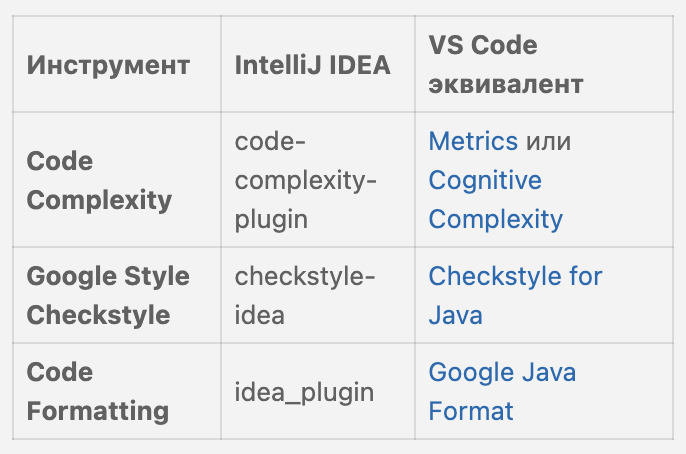

### 2.1 Когнитивная сложность (Metrics)

`Server.java`	
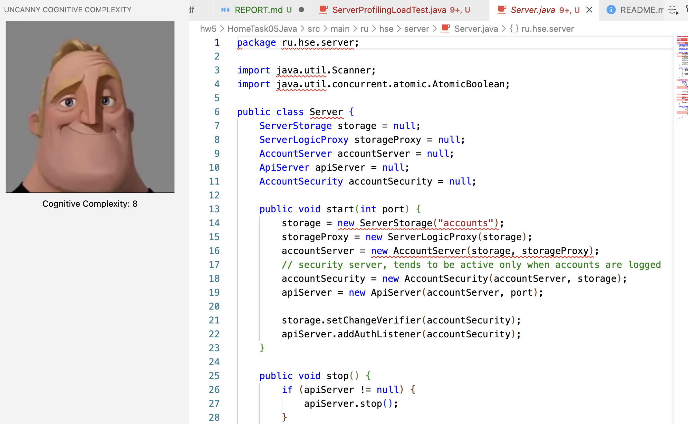

`Account.java`	
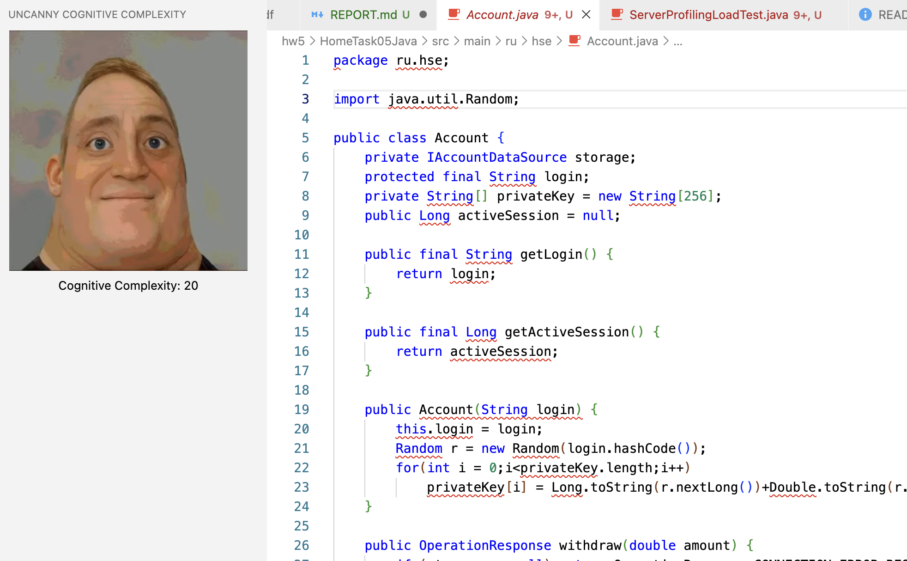

`ServerStorage.java`	
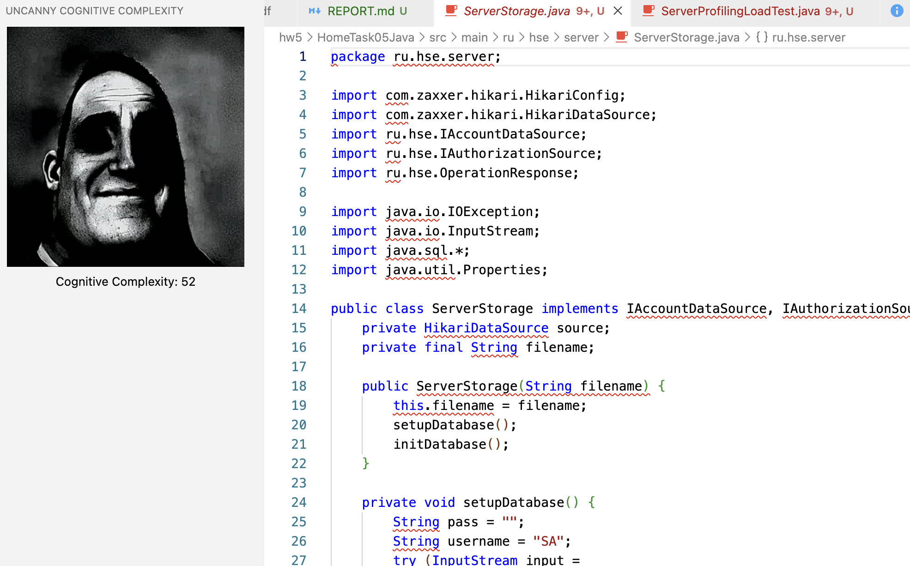

То есть, файл `ServerStorage` самый когнитивно сложный 

К сожалению, это расширение может посмотреть только весь файл, а не каждую функцию отдельно 

### 2.2 Google Java Style (Checkstyle + Google Java Format)

#### Этап 1: Проверка нарушений стиля (Checkstyle)

Checkstyle для файла `ServerStorage.java`

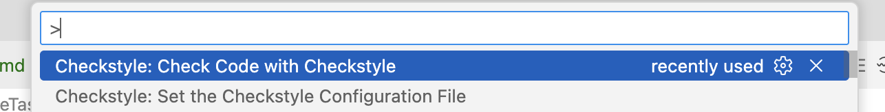
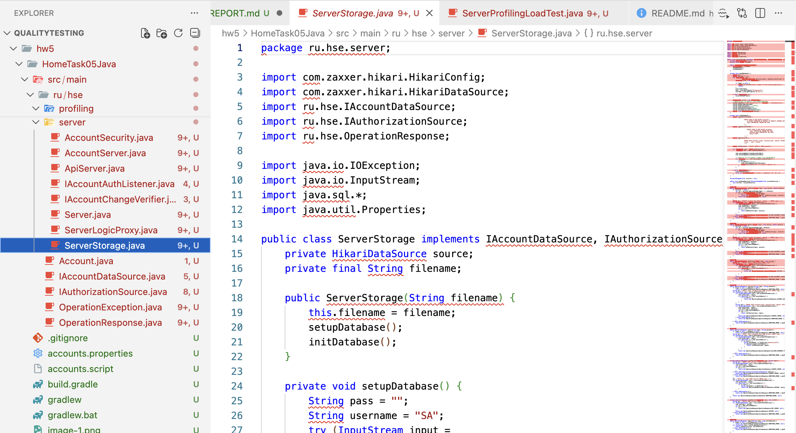

Все красное. Надеюсь, так и должно быть) 

Используем именно Google Format

#### Этап 2: Форматирование кода
Плагин: Google Java Format

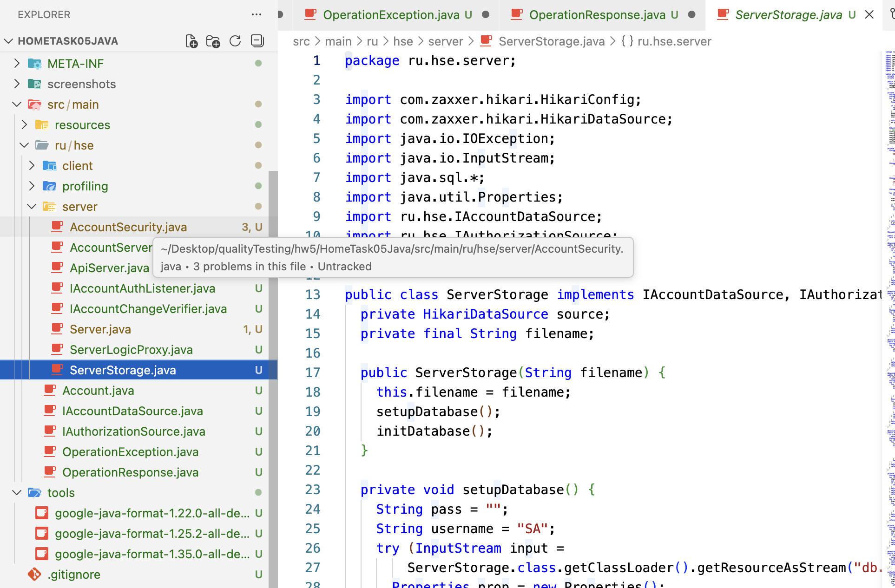

В общем это оказалось не так и просто   
Файлы постоянно ругались    

Пришлось установить 3 дополнительных файла для работы этого расширения      
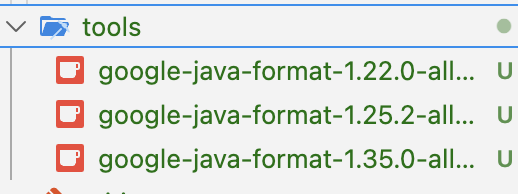        

Потом все равно было много красных стрелочек, поэтому делал инструкцию от AI     

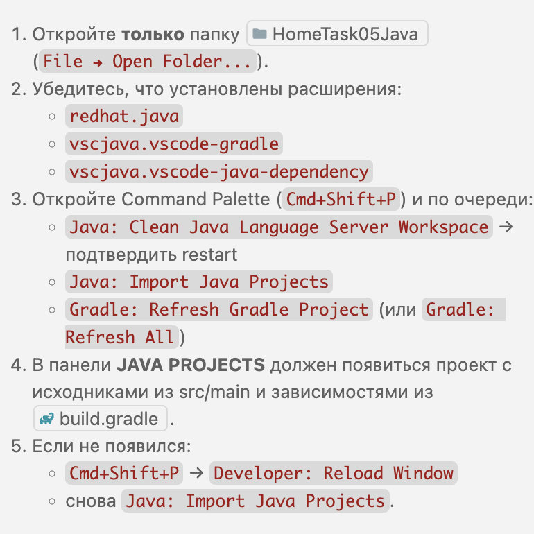

Кажется, только этого все стало зеленым     
Надеюсь, такой результат подходит     

Но, если честно, сам до конца не уверен, что там поменялось

---

## 3. Профилирование
Добавлен класс:
- `src/main/ru/hse/profiling/ServerProfilingLoadTest.java`

Сценарий:
- регистрация аккаунта,
- депозит 100,
- снятие 200,
- снятие 50,
- logout,
- периодические неудачные попытки логина.

Поддерживает запуск с параметрами:
- `iterations` (по умолчанию 300000),
- `port` (по умолчанию 7001).

Пример запуска:
- `./gradlew runProfilingLoadTest --args='300000 7001'`

Вот что он вывел:   
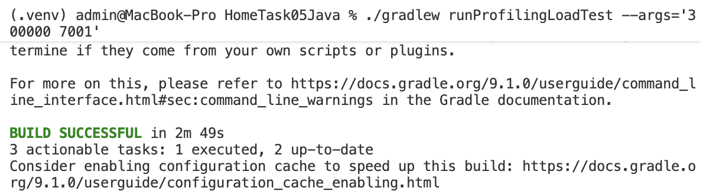

Как я понял профилировщик создал файл `profiling.jfr`

После запуска проанализировали heap    
(запускал на более быстром тесте, так как исходный идет 2 минуты) 
Создался файл `profiler_heap_after_fix.txt`     

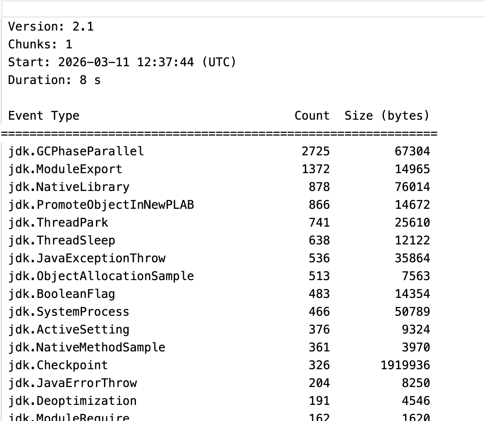

Вот потенциальные утечки памяти     

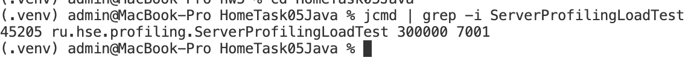

В общем, надеюсь это примерно то, что и предполагалось

Кстати, вот еще есть такой HTML отчет    
`hw5/HomeTask05Java/build/reports/problems/problems-report.html`

Дальше вот что написал мне AI:

### Что было исправлено в профилировании
- `NullPointerException` в `Client.deposit(...)`, если на итерации `register(...)` возвращал `null`.

Исправления:
1) `src/main/ru/hse/profiling/ServerProfilingLoadTest.java`
- добавлена защита от `null` после `register(...)` (итерация учитывается как `failed`, тест не падает),
- логин сделан уникальным для каждого запуска (`runId`), чтобы не конфликтовать с уже созданными пользователями в БД.

2) `src/main/ru/hse/client/Client.java`
- в `register(...)` добавлена обработка `INCORRECT_RESPONSE` как исключения.

3) `src/main/ru/hse/client/AccountManager.java`
- в `register(...)` добавлена корректная обработка `ALREADY_INITIATED`.

### Проверка правил серверной части
Проверено:
1) После logout очищаются in-memory структуры сессий (`activeSessions`, `sessionEnabled`).
2) После logout данные аккаунта остаются только в БД.
3) При остановке сервера закрывается пул БД (`HikariDataSource`) и останавливается web-server.

